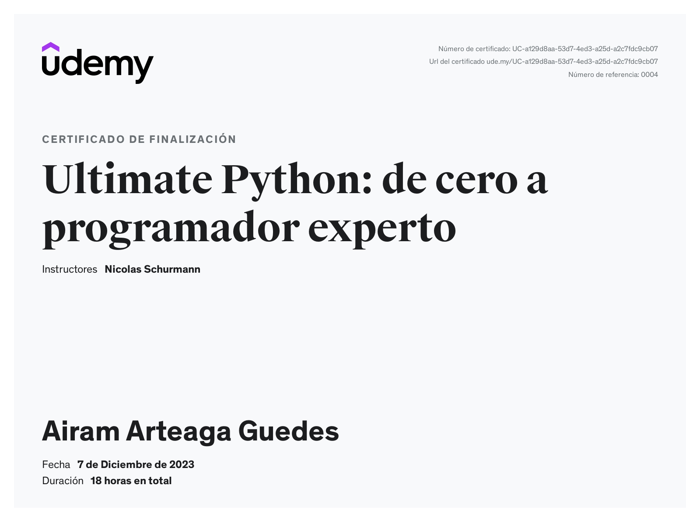

## Ultimate Python: De cero a programador experto

**1 - Intalar Python**

- [Descarga de Python](https://www.python.org/downloads/)

 

**2 - Editor de código**

- [Descarga de Visual Studio Code](https://code.visualstudio.com/download)

 

**3 - Extensiones**

- [Python](https://marketplace.visualstudio.com/items?itemName=ms-python.python)

- [Pylint](https://marketplace.visualstudio.com/items?itemName=ms-python.pylint)

- [autopep8](https://marketplace.visualstudio.com/items?itemName=ms-python.autopep8)

 

## Certificado de finalización

